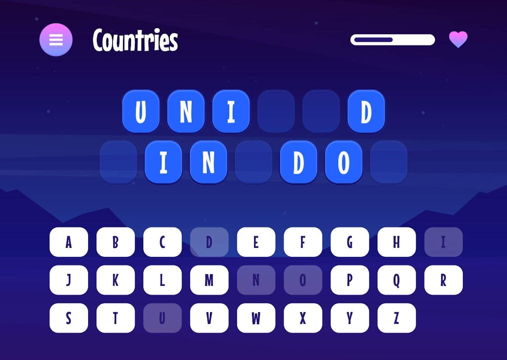

# Frontend Mentor - Hangman game solution

This is a solution to the [Hangman game challenge on Frontend Mentor](https://www.frontendmentor.io/challenges/hangman-game-rsQiSVLGWn). Frontend Mentor challenges help you improve your coding skills by building realistic projects.

## Table of contents

- [Overview](#overview)
  - [The challenge](#the-challenge)
  - [Game behaviour](#game-behaviour)
  - [Screenshot](#screenshot)
  - [Links](#links)
- [My process](#my-process)
  - [Built with](#built-with)
  - [What I learned](#what-i-learned)
- [Author](#author)

## Overview

### The challenge

Users should be able to:

- Learn how to play Hangman from the main menu.
- Start a game and choose a category.
- Play Hangman with a random word selected from that category.
- See their current health decrease based on incorrect letter guesses.
- Win the game if they complete the whole word.
- Lose the game if they make eight wrong guesses.
- Pause the game and choose to continue, pick a new category, or quit.
- View the optimal layout for the interface depending on their device's screen size.
- See hover and focus states for all interactive elements on the page.
- Navigate the entire game only using their keyboard.

### Game behaviour

- Game starts picking a random word from the chosen category.
- If the player guesses correctly, all relevant spaces are filled and the letter on keyboard will be disabled.
- If the player guesses incorrectly, the letter will be disabled and the health bar reduced. The health bar will be empty after eight wrong guesses and the player loses at this point and the menu appears.
- If the player wins, the menu appears.
- Selecting "play again" on the menu starts a new game with the same category, if there are selectable options, otherwise the player is redirected to categories to pick a new one, and the all categories are reloaded.
- Selecting "new category" navigates to the "pick a category" page and reload categories.
- Quitting navigates back to the main menu and reload categories.
- Clicking the hamburger menu during a game should show the "paused" menu.

### Screenshot



### Links

- Solution URL: [https://github.com/FerdinandoGeografo/hangman-game](https://github.com/FerdinandoGeografo/hangman-game)
- Live Site URL: [https://hangman-game-fg.netlify.app/](https://hangman-game-fg.netlify.app/)

## My process

### Built with

- Semantic HTML5 markup
- SASS following 7-1 pattern and BEM conventions
- Flexbox
- CSS Grid
- Desktop-first workflow
- [Angular](https://angular.dev/) - JS Framework
- [RxJS](https://rxjs.dev/) - JS Library
- [NgRx](https://ngrx.io/guide/signals) - For signal based State Management in Angular

### What I learned

Use this section to recap over some of your major learnings while working through this project. Writing these out and providing code samples of areas you want to highlight is a great way to reinforce your own knowledge.

To see how you can add code snippets, see below:

```html
<h1>Some HTML code I'm proud of</h1>
```

```css
.proud-of-this-css {
  color: papayawhip;
}
```

```js
const proudOfThisFunc = () => {
  console.log("🎉");
};
```

## Author

- Frontend Mentor - [@FerdinandoGeografo](https://www.frontendmentor.io/profile/FerdinandoGeografo)
- LinkedIn - [@FerdinandoGeografo](https://www.linkedin.com/in/ferdinandogeografo/)
- GitHub - [@FerdinandoGeografo](https://github.com/FerdinandoGeografo/)
